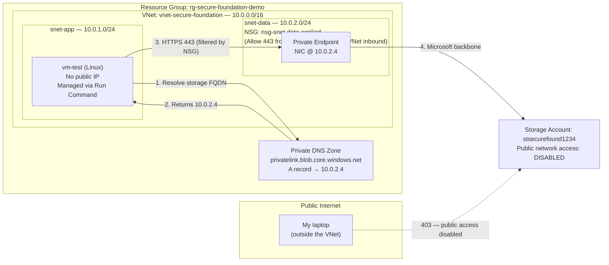
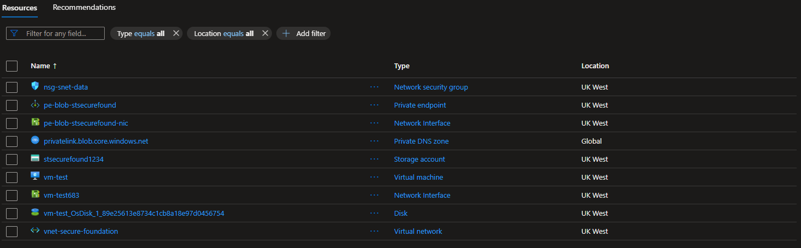
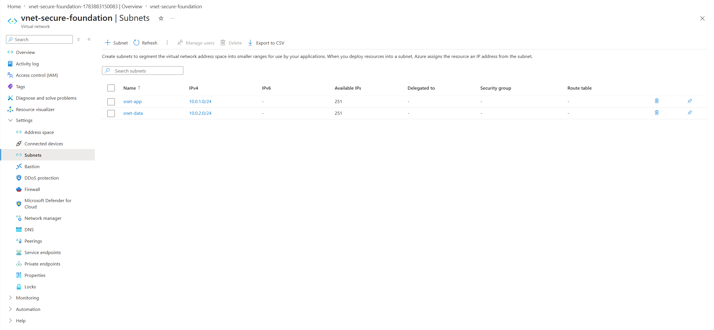
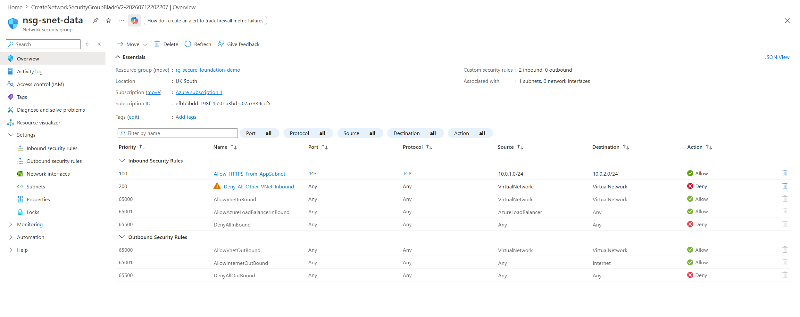
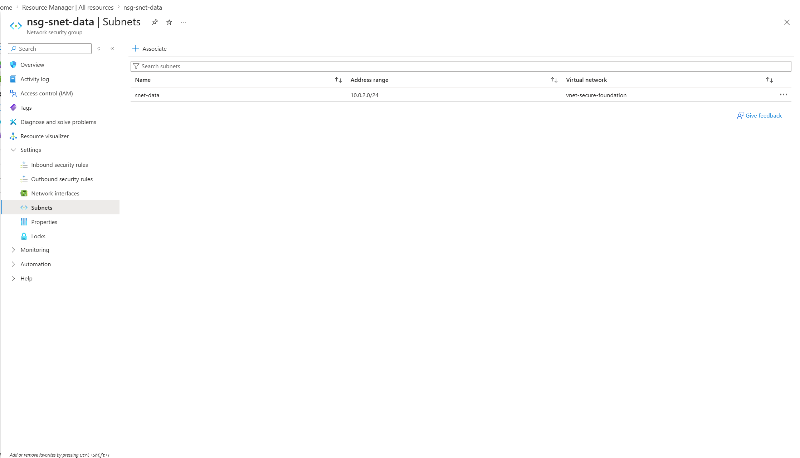
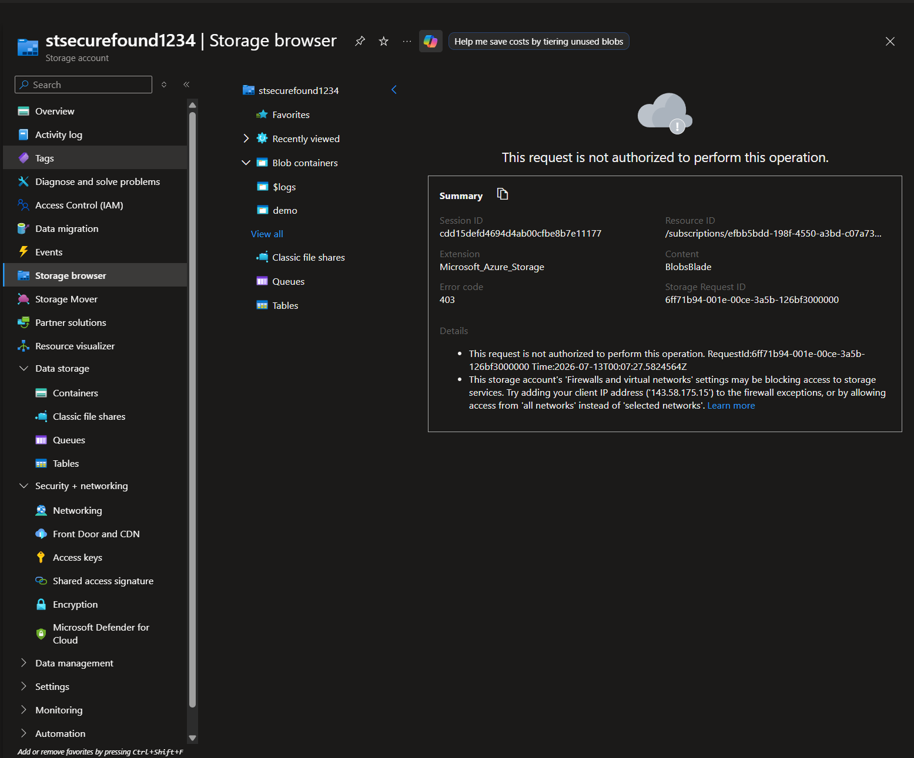
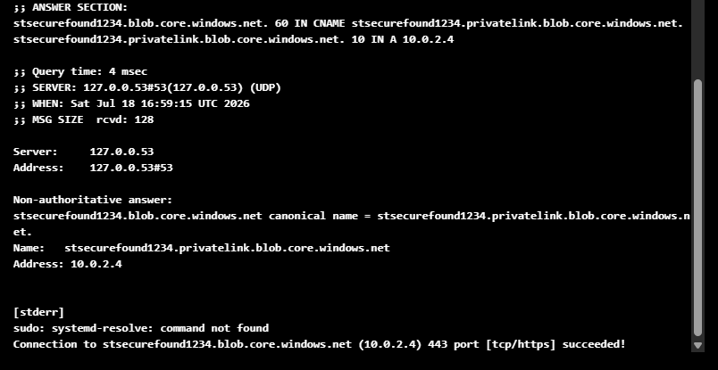
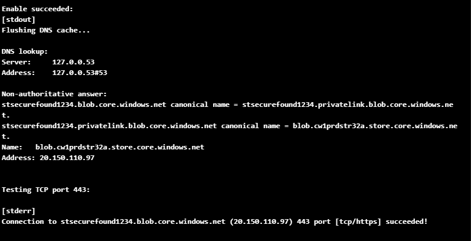
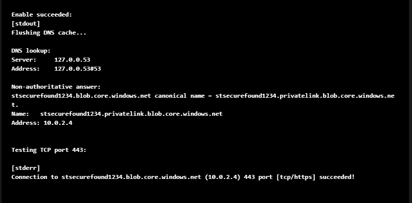

# Azure Secure Network Foundation — Phase 1

A hands-on Azure networking project: I took a storage account that was reachable from anywhere on the internet, removed its public access entirely, and rebuilt the only way in as a private path through a Private Endpoint — then proved every control actually works, including deliberately breaking DNS to reproduce a classic production outage.

**Status:** Phase 1 (manual portal build) complete. Phase 2 (Terraform), Phase 3 (Azure DevOps pipeline), and Phase 4 (PowerShell validation) are planned.

`Azure` · `Networking` · `Private Endpoints` · `Private DNS` · `NSG` · `Managed Identity`

---

## Why I built this

Azure PaaS services like Storage Accounts sit on the public internet by default. I wanted to prove with evidence that I could remove that exposure and replace it with private connectivity, and that I understand the failure modes well enough to cause one and fix it.

I built this manually in the portal on purpose. Automating something you don't understand just produces automated confusion. Terraform comes in Phase 2, once the model is solid.

The single most important idea in this project:

> **A Private Endpoint creates private connectivity. A Private DNS zone makes the hostname resolve to the private IP. They are two separate problems, and fixing one does not fix the other.**

I built them separately, watched the gap between them, and broke the DNS half on purpose to see exactly how it fails.

---

## Architecture

Everything lives in one resource group in **UK West** (the Private DNS zone is a global resource). The NSG isn't a device traffic passes through — it's a rule set applied to the `snet-data` subnet, filtering traffic headed for the private endpoint.



---

## Resources created

| Resource | Name | Purpose |
|---|---|---|
| Resource group | `rg-secure-foundation-demo` | Single cleanup boundary |
| Virtual network | `vnet-secure-foundation` (10.0.0.0/16) | Private address space |
| Subnet | `snet-app` (10.0.1.0/24) | Where the test VM lives |
| Subnet | `snet-data` (10.0.2.0/24) | Where the private endpoint lives |
| Network security group | `nsg-snet-data` | Internal segmentation between subnets |
| Storage account | `stsecurefound1234` | The PaaS service being protected |
| Private endpoint | `pe-blob-stsecurefound` | Private IP `10.0.2.4` in front of blob storage |
| Private DNS zone | `privatelink.blob.core.windows.net` | Makes the hostname resolve privately |
| Virtual machine | `vm-test` (Linux, no public IP) | In-VNet test client, driven via Run Command |



---

## Build summary

I created the VNet with two subnets — one for workloads, one for the data path — because an NSG rule like "the app tier may reach the data tier" only means something if those tiers are actually separate.



On the NSG, I looked at the default rules first (screenshot [03](docs/screenshots/03-nsg-default-rules.png)). Azure already denies all inbound from the internet at priority 65500, so writing my own "deny all inbound" rule would be theatre. The default worth overriding is **65000 AllowVnetInBound**, which lets anything in the VNet talk to anything else. I added `Allow-HTTPS-From-AppSubnet` (priority 100, TCP 443 from 10.0.1.0/24) and `Deny-All-Other-VNet-Inbound` (priority 200), then associated the NSG with `snet-data`.




I deliberately left the storage account public at first and confirmed the `demo` container was reachable — you can't prove you closed a door without first showing it was open ([06](docs/screenshots/06-before-public-access.png)). Then I created the private endpoint for the `blob` sub-resource, which was auto-approved and picked up `10.0.2.4` from `snet-data` ([07](docs/screenshots/07-pe-connection-approved.png), [08](docs/screenshots/08-pe-private-ip.png)).

With the private path in place, I set **Public network access: Disabled** ([09](docs/screenshots/09-public-access-disabled.png)). Refreshing Storage Browser from my laptop now returns a **403 — "This request is not authorized to perform this operation"**:



Finally I built DNS by hand rather than letting the wizard do it: the `privatelink.blob.core.windows.net` zone with an A record `stsecurefound1234 → 10.0.2.4` ([11](docs/screenshots/11-dns-a-record.png)), linked to the VNet ([12](docs/screenshots/12-dns-vnet-link.png)). The A record is managed by a DNS zone group, so Azure keeps it in sync with the endpoint's IP instead of me maintaining a hand-typed record that could silently go stale.

---

## Validation

All in-VNet tests ran on `vm-test` through **Run Command** — the VM has no public IP, no open SSH, and no Bastion. Standard Cloud Shell wasn't an option because it isn't deployed inside my VNet and would return the public IP even against a perfect build.

| Test | Result | Evidence |
|---|---|---|
| Public access before hardening | Container visible from portal | [06](docs/screenshots/06-before-public-access.png) |
| Public access after hardening | **HTTP 403** | [10](docs/screenshots/10-public-access-blocked-403.png) |
| DNS resolution from inside the VNet | CNAME → privatelink → **10.0.2.4** | [13](docs/screenshots/13-private-nslookup-success.png) |
| TCP 443 from inside the VNet | Connection to 10.0.2.4 succeeded | [13](docs/screenshots/13-private-nslookup-success.png) |
| NSG with endpoint network policies **disabled** | Deny rule active — traffic still flowed | [15](docs/screenshots/15-nsg-bypassed.png) |
| NSG with endpoint network policies **enabled** | Same deny rule — connection timed out | [16](docs/screenshots/16-nsg-enforced.png) |
| Keyless data access via managed identity | Blob listed, HTTP 200, no keys or SAS | [19](docs/screenshots/19-keyless-access-via-managed-identity.png) |



**The NSG test is the one most people skip.** The subnet's *private endpoint network policy* setting was Disabled by default ([14](docs/screenshots/14-pe-network-policy.png)) — and in this build, NSG rules were bypassed for Private Endpoint traffic while that policy was disabled. I set an explicit deny and watched traffic flow straight through it. Only after enabling the policy did the same deny rule actually block the connection. An NSG can look perfectly configured in the portal and enforce nothing.

For data access, I enabled a system-assigned managed identity on the VM, gave it **Storage Blob Data Reader** on the storage account, and listed the `demo` container over the private endpoint — no account keys, no SAS tokens, just Entra ID and RBAC ([19](docs/screenshots/19-keyless-access-via-managed-identity.png)).

---

## The DNS failure I caused on purpose

This is the classic private endpoint outage, reproduced deliberately.

**The break:** I deleted the private DNS zone's VNet link. Nothing else — the endpoint stayed Approved, the firewall stayed correct.

**What happened:** DNS didn't error out. It just started giving a different answer. With the private zone unlinked, the storage hostname resolved to its **public IP** (`20.150.110.97`) instead of the private one. TCP 443 to that public IP even connected, because Azure's shared storage front end accepts connections before deciding whether you're allowed in. So on the surface everything looked healthy — name resolves, port is open — but an actual storage request would have been blocked, because public network access was disabled. That's what makes this failure so nasty in production: the quick checks all pass while the app is down.



**The fix:** recreate the VNet link, flush the client DNS cache, re-test. Resolution returned to `10.0.2.4` and connectivity was restored. The cache flush matters — without it the VM serves the stale public answer and you'd conclude the fix didn't work.



---

## Lessons learned

- A private endpoint gives you connectivity; private DNS gives you name resolution. They fail independently, and the DNS failure is the sneaky one — it looks healthy at every layer except the application.
- In this build, NSG rules were bypassed for Private Endpoint traffic while the subnet's Private Endpoint network policy was disabled. I only trusted my deny rule after watching it actually block something.
- "TCP connects" is not "I have access." A shared PaaS front end completes the handshake and rejects you at the HTTP layer, so the real proof that public access is blocked is a 403, not a failed port test.
- Test from where the traffic actually originates. Standard Cloud Shell isn't deployed inside your VNet and will show the public IP against a flawless build.
- Run Command gave me in-VNet command execution with zero inbound exposure — no public IP, no Bastion, no cost.

---

## Cost awareness

The environment was designed to stay under £2 for the week. The private endpoint (~£0.007/hr) and the VM were the only meaningful charges; the VNet, subnets, and NSG are free, and the DNS zone and storage account are pennies. One trap worth knowing: a deallocated VM stops billing for compute but its disk keeps billing — orphaned disks are the classic surprise on an Azure bill.

## Cleanup

Everything sits in one resource group, so cleanup is a single action:

```bash
az group delete --name rg-secure-foundation-demo --yes
```

If deleting manually instead, the order matters: things holding IP addresses (VM, private endpoint) go before the network that provides them, and the DNS zone's VNet link goes before the zone itself.

---

*Personal project, built to bridge my service desk and identity experience toward Azure cloud engineering. Phase 2 rebuilds this same foundation in Terraform.*
